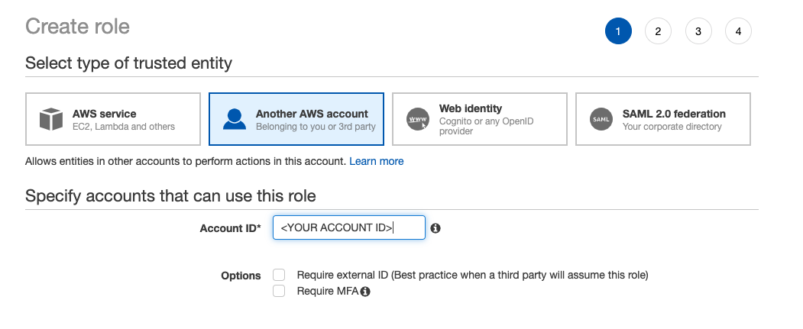

# Amazon Kinesis Cross-Account Client Node.js
This example application uses the official [Amazon Kinesis Client Library for Node.js](https://github.com/awslabs/amazon-kinesis-client-nodejs) with cross-account Kinesis access.

Cross-account access is when, in our case, The Washington Post has a Kinesis stream they want to share with an [ARC](http://www.arcpublishing.com) customer.  The Washington Post creates an IAM role that our customer can assume to access our Kinesis stream.

# ARC Customer - Kinesis Consumer Example
If you are an ARC customer and have been given a Kinesis stream with all your stories, images, videos, then this sample is for you!

This Kinesis stream is populated with the following information:
* [Stories](https://github.com/washingtonpost/ans-schema/blob/master/src/main/resources/schema/ans/0.5.7/content_operation.json)
* [Images](https://github.com/washingtonpost/ans-schema/blob/master/src/main/resources/schema/ans/0.5.7/image_operation.json)
* [Videos](https://github.com/washingtonpost/ans-schema/blob/master/src/main/resources/schema/ans/0.5.7/video_operation.json)

# Setup
## Step 1 - AWS Account Credentials from Consuming Account
In order to consume the Kinesis stream events in another system, we need your AWS Account ID. Please provide us with the AWS Account ID of the account you'll be accessing Kinesis from.

## Step 2 - IAM Roles
Once your account information is known, we can create two IAM Users -- one in each account. The IAM User in the Consuming Account will be paired with the IAM User in the Arc AWS Account in order to enable cross-account access to the Kinesis Stream. 

### IAM Role in the Arc Account

In the Arc account, we'll first create an IAM role that is able to peer with the user you create in your Consuming Account. First, we'll create the policy this role needs:

In the AWS console for the Arc Account create a new IAM role.
* Navigate to IAM > Policies
* Create a policy that can connect to the stream for this particular customer 


```
{
    "Version": "2012-10-17",
    "Statement": [
        {
            "Sid": "Stmt1475084675000",
            "Effect": "Allow",
            "Action": [
                "kinesis:GetShardIterator",
                "kinesis:GetRecords",
                "kinesis:DescribeStream",
                "kinesis:ListStreams",
                "kinesis:ListShards",
                "kinesis:ListStreamConsumers"
            ],
            "Resource": "arn:aws:kinesis:us-east-1:1234567:stream/<ARC STREAM NAME>"
        }
    ]
}
```
Then, we'll create a Role that uses this policy: 

* Navigate to IAM > Roles
* Select "Role for Cross-Account Access"
* Then "Another AWS Account."
* Add the Account ID
* Attached the policy just created




By default, the Trust Relationship on the Role should be populated with your account id:

```
{
  "Version": "2012-10-17",
  "Statement": [
    {
      "Effect": "Allow",
      "Principal": {
        "AWS": "arn:aws:iam::<YOUR ACCOUNT NUMBER HERE>:root"
      },
      "Action": "sts:AssumeRole"
    }
  ]
}
```

### IAM Role in the Consuming Account

Now that the Arc IAM Role has been created, you'll need to set up a IAM role from the Consuming Account. To do that, follow these instructions: 

In the AWS console for the Consuming Account create a new IAM role.
* Navigate to IAM > Policies
* Create a policy that grants access to the Security Token Service.  Use the role ARN The Washington Post provided as the Resource. 

Example policy:
```
{
    "Version": "2012-10-17",
    "Statement": [
        {
            "Sid": "Stmt1475158944000",
            "Effect": "Allow",
            "Action": [
                "sts:*"
            ],
            "Resource": [
                "<WAPO ARN HERE>"
            ]
        },
         {
             "Sid": "Stmt1475084967000",
             "Effect": "Allow",
             "Action": [
                 "dynamodb:CreateTable",
                 "dynamodb:DescribeTable",
                 "dynamodb:DeleteItem",
                 "dynamodb:GetItem",
                 "dynamodb:PutItem",
                 "dynamodb:Scan",
                 "dynamodb:UpdateItem"
             ],
             "Resource": [
                 "*"
             ]
         },
         {
             "Sid": "Stmt1475085048000",
             "Effect": "Allow",
             "Action": [
                 "cloudwatch:PutMetricData"
             ],
             "Resource": [
                 "*"
             ]
         }
    ]
}
```
Once the policy has been created, create a user. 

* Navigate to IAM > Users > Add User
* Ensure your user has Programmatic Access in order to generate an Access Key and Secret.
* In the Permissions screen, attach the policy that you created in the step above. 
* Once created, you'll have the opportunity to download a .csv with the Access Key and Secret. Download this for use later. 

## Step 3 - Configure your Docker Image
Get the Arc AWS Account IAM Role ARN and Kinesis stream name from The Washington Post.

Use the Kinesis stream name to populate the "streamName" found in [properties/kcl.properties](properties/kcl.propertis). The streamName should look something like `com.arcpublishing.organization.content.ans.v3` but will be provided by The Washington Post. 

Use the Arc AWS Account IAM Role to populate the second field in "AWSCredentialsProvider" found in [properties/kcl.properties](properties/kcl.propertis). This is NOT the IAM Role that you created in your consuming account. 

Now use your Consuming Account IAM user credentials to populate the AWS_ACCESS_KEY_ID and AWS_SECRET_ACCESS_KEY found in [docker-compose.yml](docker-compose.yml).

## Run Sample
Install and setup [Docker Compose](https://docs.docker.com/compose/).

Run the following commands to build and run this docker container.
```
docker-compose build
docker-compose up
```

### Reading the node.js logs
To execute bash commands on your running docker container you can do the following:
```
docker ps   # to determine the container id.
docker exec -t -i mycontainer /bin/bash
```
Then you can view the node.js logs via this command:
```
tail -f logs/application.log
```
